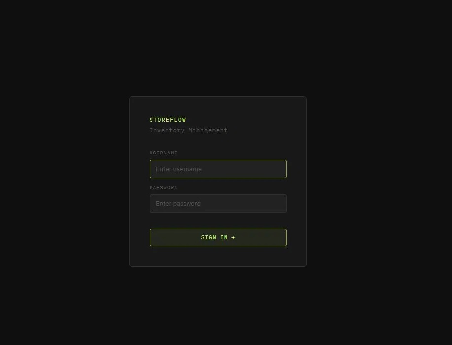

# StoreFlow

Inventory management application for small business owners. Built with Spring Boot, secured with Spring Security, backed by PostgreSQL.




---

## Tech Stack

| Layer | Technology |
|-------|-----------|
| Language | Java 17 |
| Framework | Spring Boot |
| Security | Spring Security + BCrypt |
| Data Access | Spring Data JPA + Hibernate |
| Database | PostgreSQL |
| Frontend | Thymeleaf + HTML/CSS |
| Build Tool | Maven |

---

## Features

- Add, update, delete inventory items
- Sell items by quantity — handles out of stock, insufficient stock, and category ambiguity
- Duplicate detection — adding an existing item updates quantity instead of creating a duplicate
- Search by name and optional category filter
- Visual stock indicators — amber for low stock (<5), red for out of stock
- BCrypt password hashing
- Multi-layer input validation — browser level and server level with flash message feedback
- Global exception handling via `@ControllerAdvice`

---

## Project Structure

```
src/main/java/com/victor/inventorymanagementweb/
├── controllers/
│   ├── InventoryController.java    # Request handling, flash messages, redirects
│   ├── LoginController.java        # Serves login page on GET /login
│   └── GlobalExceptionHandler.java # Catches MethodArgumentTypeMismatchException and general exceptions
├── models/
│   ├── Item.java                   # JPA entity → items table
│   └── OperationResult.java        # Enum for all service outcomes
├── repository/
│   └── ItemRepository.java         # Spring Data JPA — derived queries
├── security/
│   └── SecurityConfig.java         # Filter chain, BCrypt bean, InMemoryUserDetailsManager
└── services/
    └── InventoryService.java       # All business logic and validation
```

---

## Setup

### Prerequisites
- Java 17+
- Maven
- PostgreSQL

### Run locally

```bash
git clone https://github.com/VictorStefanS/StoreFlow-Inventory-Management-System.git
cd StoreFlow-Inventory-Management-System
```

Create the database:

```sql
CREATE DATABASE inventorydb;
```

Copy and configure properties:

```bash
cp inventory-management-web/src/main/resources/application.properties.example \
   inventory-management-web/src/main/resources/application.properties
```

Set the required environment variables from `application.properties.example`, then:

```bash
cd inventory-management-web
mvn spring-boot:run
```

App runs at `http://localhost:8080`.


---

## Testing

Manual test cases in [TEST_CASES.md](inventory-management-web/TEST_CASES.md) — covers type mismatches, boundary conditions, and flow edge cases.
---

## Roadmap

- [ ] Unit tests for `InventoryService`
- [ ] Pagination
- [ ] Low stock alerts
- [ ] REST API + React frontend
- [ ] Transaction history
- [ ] CSV export
