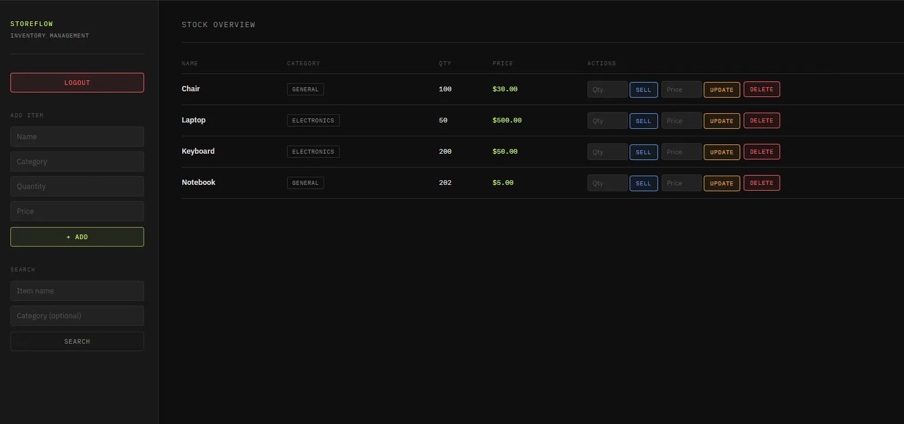

# StoreFlow

A full stack inventory management application built for small business owners to track stock, process sales, and manage product pricing — all from a single, secure interface.

---

## Screenshots

### Login


### Stock Overview


---

## Features

- **Add items** — add new products with name, category, quantity, and price. If the item already exists in the same category, the quantity is automatically updated instead of creating a duplicate
- **Sell items** — process a sale by quantity. Handles out of stock, insufficient stock, and ambiguous name conflicts across categories
- **Update pricing** — update the price of any item independently of stock operations
- **Delete items** — remove items from inventory permanently
- **Search** — find items by name, optionally filtered by category
- **Stock indicators** — quantities are colour coded: red for out of stock, amber for low stock (under 5 units)
- **Authentication** — the entire application is protected by a login system. Passwords are hashed using BCrypt
- **Input validation** — validated at both the browser and server level with user-friendly flash messages for every error state
- **Global exception handling** — unexpected errors are caught and surfaced as flash messages rather than white error screens

---

## Tech Stack

| Layer | Technology |
|-------|-----------|
| Language | Java 17 |
| Framework | Spring Boot |
| Security | Spring Security + BCrypt |
| Data Access | Spring Data JPA + Hibernate |
| Database | PostgreSQL |
| Frontend | Thymeleaf + HTML/CSS |
| Build Tool | Maven |

---

## Project Structure

```
src/main/java/com/victor/inventorymanagementweb/
├── controllers/
│   ├── InventoryController.java    # Handles all HTTP requests
│   ├── LoginController.java        # Serves the login page
│   └── GlobalExceptionHandler.java # Catches unhandled exceptions
├── models/
│   ├── Item.java                   # JPA entity mapped to the items table
│   └── OperationResult.java        # Enum representing all possible outcomes
├── repository/
│   └── ItemRepository.java         # Data access layer — JPA queries
├── security/
│   └── SecurityConfig.java         # Spring Security configuration
└── services/
    └── InventoryService.java       # Business logic layer
```

---

## Getting Started

### Prerequisites

- Java 17+
- Maven
- PostgreSQL

### 1. Clone the repository

```bash
git clone https://github.com/VictorStefanS/StoreFlow-Inventory-Management-System.git
cd StoreFlow-Inventory-Management-System
```

### 2. Create the database

Open pgAdmin or any PostgreSQL client and create a new database:

```sql
CREATE DATABASE inventorydb;
```

### 3. Configure environment variables

Set the following environment variables on your machine:

| Variable | Description |
|----------|-------------|
| `DB_USERNAME` | Your PostgreSQL username |
| `DB_PASSWORD` | Your PostgreSQL password |
| `APP_USERNAME` | Login username for the app |
| `APP_PASSWORD` | Login password for the app |

On Windows: Search for **Edit the system environment variables** → Environment Variables → New

### 4. Set up application.properties

Copy the example config file and rename it:

```bash
cp src/main/resources/application.properties.example src/main/resources/application.properties
```

### 5. Run the application

```bash
mvn spring-boot:run
```

The app will be available at `http://localhost:8080`. On first run, Hibernate automatically creates the `items` table in your database.

---

## Architecture

StoreFlow follows a layered architecture with clear separation of concerns:

- **Controller** — receives HTTP requests, delegates to the service, returns responses. Contains no business logic
- **Service** — all business rules live here. Validates input, makes decisions, orchestrates data access
- **Repository** — data access only. Spring Data JPA generates SQL from method names automatically
- **Model** — defines the data structure. The `Item` entity maps directly to the database table

This means the database, business logic, and presentation layers are fully independent — swapping PostgreSQL for another database, or replacing Thymeleaf with a React frontend, would not require changes to the business logic layer.

---

## Testing

Manual test cases covering type mismatches, boundary conditions, and flow edge cases are documented in [TEST_CASES.md](TEST_CASES.md).

One bug was identified and fixed during testing — items with names exceeding 100 characters were silently rejected with no user feedback. A length validation check was added to `InventoryService`.

---

## Future Improvements

- [ ] Unit tests for `InventoryService` business logic
- [ ] Pagination for large inventories
- [ ] Low stock threshold alerts
- [ ] REST API endpoints for potential React frontend migration
- [ ] Transaction history — log every sale with timestamp and quantity
- [ ] Export inventory to CSV
